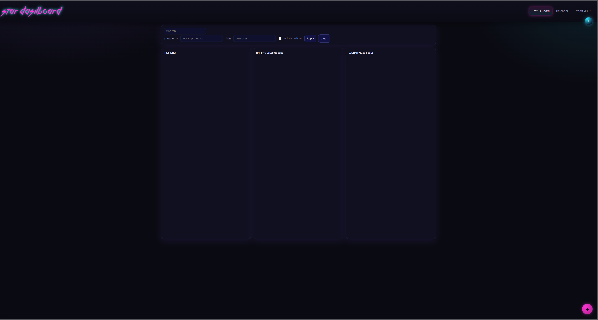

# STAR Dashboard

**Status Tracking & AI Reporting Dashboard**
*A Local, Offline-First Task Management App*

[GitHub release (latest)](https://github.com/vamsi-karnam/STAR-Dashboard/releases/tag/v1.0)

> **Personal Use Only — No Commercial Use.**
> See [LICENSE](https://github.com/vamsi-karnam/STAR-Dashboard?tab=License-1-ov-file) for full terms.
> Attribution Required: “Based on software by **Sai Vamsi Karnam**”

---

## Preview

| Status Board                                          |
| ----------------------------------------------------- | 
|  |

---

## Overview

**STAR Dashboard** (Status Tracking & AI Reporting) is a lightweight, offline-first productivity and tracking dashboard built for **personal use**.
It’s inspired by Task tracking applications - but redesigned for simplicity, complete privacy, and full local control.

Runs locally via **Flask**, stores everything in a local **SQLite** database, and requires no sign-up, network access, or telemetry.

> The **AI Reporting** and analytics module is currently **in development**, but the **task tracking dashboard** is fully functional.

---

## Features

### Status Board

* Drag-and-drop **To Do → In Progress → Completed** workflow
* Each task includes:

  * Title, description
  * **Start & End Dates**
  * **Project Tag(s)** for classification
  * Comments & attachments (any file/image type)
* Fully persistent - data saved locally in your app directory

### Calendar

* Integrated timeline visualization
* Syncs automatically with all tasks and their dates
* Local timezone aware

### Tag Filters

* Filter by multiple tags or hide selected ones
* Combine filters (e.g. *show: Work + Learning*, *hide: Personal*)
* One-click “Clear Filters”

### Local Persistence

* Data stored in `data.db`
* File attachments saved alongside it
* No internet dependency - works completely offline

### Theme & Design

* **Cyberpunk Neon** look - neon blues and pinks
* Offline fonts: *Kill The Noise*, *Orbitron*, *Rajdhani*
* Dark aesthetic optimized for long work sessions

### Developer Info

* Floating “ℹ️” button opens developer/contact info
* Great segue for future built-in LLM assistant

---

## Upcoming: AI Reporting Module

The AI component will provide:

* Task & progress summaries
* Natural-language queries (e.g. *“What do I have to work on this week?”*)
* Smart trend visualization & project analytics

*(Coming soon — stay tuned.)*

---

## 🛠️ Installation

### 🪟 Option 1 - Download Prebuilt App

Go to the [**Releases**](https://github.com/vamsi-karnam/STAR-Dashboard/releases) page and grab the latest version for your OS:

* **Windows:** `STAR-Dashboard-Windows-vX.Y.Z.zip`
* **macOS:** `STAR-Dashboard-macOS-vX.Y.Z.zip`

Extract and run:

* `STAR Dashboard.exe` (Windows)
* `STAR Dashboard.app` (macOS - *right-click → Open* first time)

The app will auto-launch in your browser at
**[http://127.0.0.1:5000](http://127.0.0.1:5000)**

---

### Option 2 - Run from Source

```bash
git clone https://github.com/vamsi-karnam/STAR-Dashboard.git
cd STAR-Dashboard/source
pip install -r requirements.txt
python app.py
```

Then visit [http://127.0.0.1:5000](http://127.0.0.1:5000)

---

## Repository Structure

```
STAR-Dashboard/
├─ LICENSE
├─ README.md
├─ .github/workflows/release.yml
├─ docs/
│  ├─ screenshot_board.png
│  └─ screenshot_calendar.png
└─ source/
   ├─ app.py
   ├─ requirements.txt
   ├─ static/
   │  ├─ styles.css
   │  ├─ app.js
   │  └─ fonts/
   └─ templates/
      ├─ base.html
      ├─ board.html
      ├─ calendar.html
      └─ _task_card.html
```

---

## Usage Guide

1. **Launch STAR Dashboard** → browser opens automatically.
2. Click the **＋ button** to add a new task.

   * Set start & end dates.
   * Add tag(s).
   * Optionally upload files or notes.
3. Drag tasks between columns as progress changes.
4. Click a task to open details, comments, or attachments.
5. Switch to **Calendar** tab for timeline view.
6. Use **Filters** to view or hide tagged tasks.
7. Use **Export JSON** (top-right) to back up data.

> All data is saved locally and automatically.

---

## Bug Reports & Contact

If you find a bug, issue, or visual glitch:
📧 **Email:** [saivamsi.karnam@outlook.com](mailto:saivamsi.karnam@outlook.com)

For **custom features, business integrations, or consulting inquiries** (e.g., Maritime IoT, Robotics, or AI systems):
📩 Reach out directly via the same email.

---

## License

**Personal Use Source License (PUSL)**
© 2025 Sai Vamsi Karnam — All Rights Reserved

You may:

* Use and modify STAR Dashboard for personal, non-commercial purposes.

You may not:

* Use it for commercial, organizational, or client-facing work.

Full license: [LICENSE](https://github.com/vamsi-karnam/STAR-Dashboard?tab=License-1-ov-file)

> Attribution required: “Based on software by Sai Vamsi Karnam”

---

## Credits

Developed by **Sai Vamsi Karnam**

> *Principal Systems Architect — IoT / Robotics / Embedded AI Systems*

📩 [vamsi.karnam@outlook.com](mailto:saivamsi.karnam@outlook.com)

---

### If you like the project, consider starring it on GitHub to support continued development!

---
